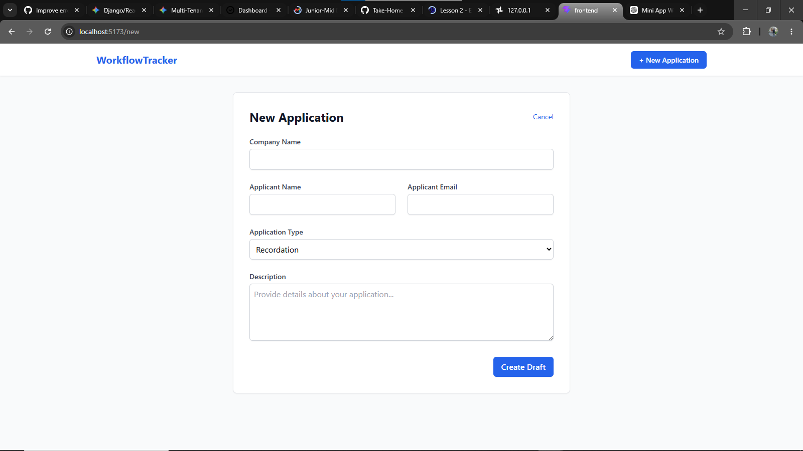

# Mini Application Workflow Tracker

**Developer:** Roney Baraka Muganda  
**Email:** barakaroney001@gmail.com

## 📸 Application Previews

<table>
  <tr>
    <td width="50%">
      <h3>1. Dashboard View</h3>
      <p align="center">
        
      </p>
    </td>
    <td width="50%">
      <h3>2. Create Form</h3>
      <p align="center">
        
      </p>
    </td>
  </tr>
  <tr>
    <td width="50%">
      <h3>3. Review Actions</h3>
      <p align="center">
        
      </p>
    </td>
    <td width="50%">
      <h3>4. Reject Application</h3>
      <p align="center">
        
      </p>
    </td>
  </tr>
</table>

A full-stack web application designed to track applications through a strict workflow:

`Draft → Submitted → Under Review → Need More Information / Approved / Rejected`

This project was built as a take-home assignment for a Junior–Mid Full-Stack Developer role, emphasizing clean architecture, strict state-machine enforcement, and modern UI/UX practices.

---

# 🚀 Tech Stack

## Backend
- **Framework:** Django (Python)
- **API Layer:** Django Ninja (for fast, Pydantic-validated REST APIs)
- **Database:** SQLite (chosen for easy setup and portability)
- **Architecture:** Fat Models / Skinny Views  
  The Finite State Machine (FSM) logic is strictly encapsulated within the Django `Application` model methods.

## Frontend
- **Framework:** React.js (Bootstrapped with Vite for performance)
- **Routing:** React Router v6
- **Styling:** Tailwind CSS (for rapid, responsive utility-class styling)
- **HTTP Client:** Axios

---

# 🛠️ Prerequisites

Make sure you have the following installed on your machine:

- **Python** v3.10+
- **Node.js** v18+

---

# 💻 Setup Instructions

## 1. Backend Setup (Django)

Open a terminal, navigate to the root directory of the project, and run the following commands:

```bash
# Navigate to the backend folder
cd backend

# Create a virtual environment
python -m venv venv

# Activate the virtual environment

# On Windows:
venv\Scripts\activate

# On Mac/Linux:
source venv/bin/activate

# Install dependencies
pip install -r requirements.txt

# Run database migrations (creates the SQLite database)
python manage.py migrate

# Start the Django development server
python manage.py runserver
```

### Backend URLs

- API Base URL:  
  `http://localhost:8000/api/`

- Swagger API Documentation:  
  `http://localhost:8000/api/docs`

---

## 2. Frontend Setup (React)

Open a **new terminal window** (keep the backend server running), navigate to the project root directory, and run:

```bash
# Navigate to the frontend folder
cd frontend

# Install Node dependencies
npm install

# Create environment configuration
echo "VITE_API_BASE_URL=http://localhost:8000/api" > .env

# Start the Vite development server
npm run dev
```

### Frontend URL

- React Frontend:  
  `http://localhost:5173/`

---

# 🧠 Architecture & Assumptions Made

To focus on the core workflow requirements, the following architectural assumptions were made:

## Authentication & Roles

For this MVP, user authentication (Login/Registration) and Role-Based Access Control (Applicant vs. Reviewer) are omitted.

Any user accessing the frontend can currently trigger:
- Applicant actions (`Submit`)
- Reviewer actions (`Approve`, `Reject`, etc.)

---

## State Machine Integrity

The workflow rules are enforced at:

### Backend Level
Django model methods raise `ValidationError` exceptions for illegal state transitions.

### Frontend Level
The UI conditionally renders buttons and strictly manages:
- Valid transition actions
- Reviewer comment requirements

This creates a double layer of protection against invalid workflow changes.

---

## Collision-Safe Tracking Numbers

Tracking numbers are automatically generated using UUIDs.

A retry loop exists inside the model’s `save()` method to prevent `IntegrityError` crashes caused by mathematical UUID collisions.

---

# 🔄 Workflow States

The application follows a strict finite-state workflow:

```text
Draft
   ↓
Submitted
   ↓
Under Review
   ├── Need More Information
   ├── Approved
   └── Rejected
```

Illegal transitions are blocked both in the backend and frontend.

---

```text
workflow-tracker/
│
├── backend/
│   ├── core/              # Django settings and root URLs
│   ├── tracker/           # Models, Pydantic schemas, and API endpoints
│   ├── manage.py
│   └── requirements.txt
│
├── frontend/
│   ├── src/
│   │   ├── api/           # Axios client setup
│   │   ├── components/    # Reusable UI (Layout, StatusBadge)
│   │   └── pages/         # React Router page views
│   ├── package.json
│   └── vite.config.js
│
└── README.md


---

# 🚀 Future Improvements

If given more time to push this project toward production readiness, the following improvements would be implemented:

---

## 1. JWT Authentication & RBAC

Implement:
- `djangorestframework-simplejwt`
- Role-Based Access Control (RBAC)

Example:
- Only users with an `is_reviewer` flag can access reviewer endpoints such as:
  - `/record-decision`
  - `/approve`
  - `/reject`

---

## 2. PostgreSQL & Docker

Upgrade the infrastructure by:
- Migrating from SQLite to PostgreSQL
- Containerizing the full stack using Docker

### Planned Services
- Backend Container
- Frontend Container
- PostgreSQL Database
- Nginx Reverse Proxy

This would allow:
- Zero-configuration deployments
- Easier scaling
- Better production reliability

---

## 3. React Query (TanStack Query)

Replace standard:
- `useEffect`
- Manual Axios fetching

with:
- React Query (TanStack Query)

Benefits:
- Automatic caching
- Background refetching
- Simplified loading states
- Better server-state management

---

## 4. Unit & Integration Testing

### Backend Testing
Add:
- `pytest`
- `pytest-django`

Tests would cover:
- State transition rules
- API validation
- Permission logic
- Model behavior

### Frontend Testing
Add:
- Vitest
- React Testing Library

Tests would ensure:
- Correct button rendering
- Proper workflow restrictions
- Form validation behavior
- API interaction handling

---

This project was intentionally designed as a lightweight MVP while still following scalable engineering principles suitable for real-world production systems.

---
